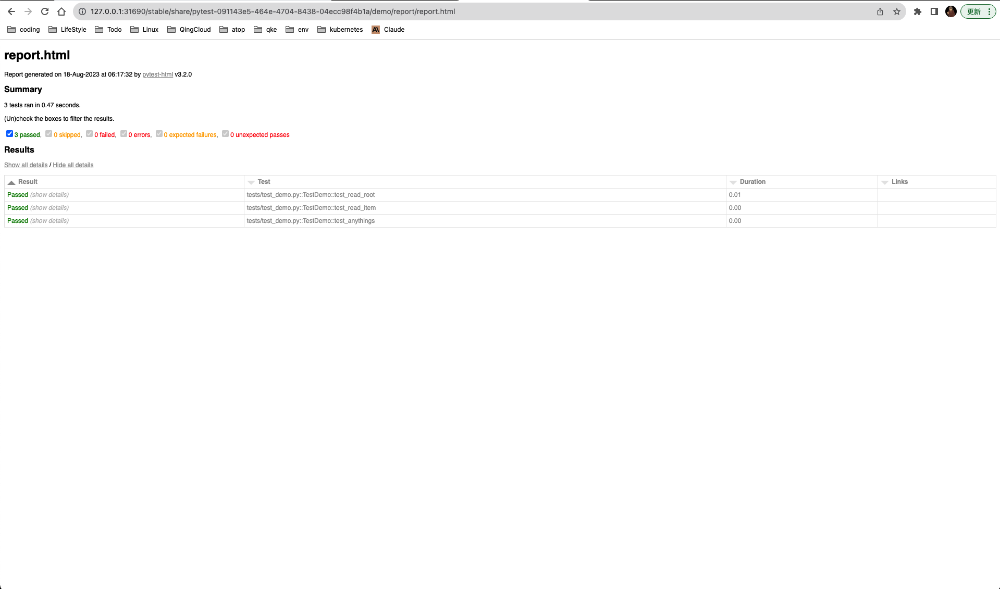

# atop

Automated Testing Open Platform

自动化测试开放平台, 让自动化测试更加简单。

## 特点

- 支持任何框架
- 支持任何语言
- 高可用
- 云原生

## 功能

- 自动化测试执行
- 通知
- 监控告警
- 测试报告持久化
- 测试日志持久化

## 快速开始

### 依赖

- Kubernetes
- helm

### 安装

使用 [k3d](https://k3d.io/v5.5.2/) 创建一个集群 three-node-cluster , 如果你已经有一个多节点 Kubernets 集群可以跳过此步骤。

```shell
～ k3d cluster create three-node-cluster -p "31690:31690@agent:0"  --agents 3

INFO[0000] Prep: Network                                
INFO[0000] Created network 'k3d-three-node-cluster'     
INFO[0000] Created image volume k3d-three-node-cluster-images 
INFO[0000] Starting new tools node...                   
INFO[0000] Starting Node 'k3d-three-node-cluster-tools' 
INFO[0001] Creating node 'k3d-three-node-cluster-server-0' 
INFO[0001] Creating node 'k3d-three-node-cluster-agent-0' 
INFO[0001] Creating node 'k3d-three-node-cluster-agent-1' 
INFO[0001] Creating node 'k3d-three-node-cluster-agent-2' 
INFO[0001] Creating LoadBalancer 'k3d-three-node-cluster-serverlb' 
INFO[0001] Using the k3d-tools node to gather environment information 
INFO[0001] HostIP: using network gateway 192.168.228.1 address 
INFO[0001] Starting cluster 'three-node-cluster'        
INFO[0001] Starting servers...                          
INFO[0001] Starting Node 'k3d-three-node-cluster-server-0' 
INFO[0004] Starting agents...                           
INFO[0004] Starting Node 'k3d-three-node-cluster-agent-2' 
INFO[0004] Starting Node 'k3d-three-node-cluster-agent-1' 
INFO[0004] Starting Node 'k3d-three-node-cluster-agent-0' 
INFO[0009] Starting helpers...                          
INFO[0009] Starting Node 'k3d-three-node-cluster-serverlb' 
INFO[0015] Injecting records for hostAliases (incl. host.k3d.internal) and for 5 network members into CoreDNS configmap... 
INFO[0017] Cluster 'three-node-cluster' created successfully! 
INFO[0017] You can now use it like this:                
kubectl cluster-info
```

添加 atop/apisix chart 仓库并更新

```shell
helm repo add atop https://no8ge.github.io/chartrepo
helm repo add apisix https://charts.apiseven.com
helm repo update
```

安装 apisix 网关到集群

```shell
～ helm upgrade --install apisix apisix/apisix --version 1.3.1  --create-namespace --namespace apisix --set gateway.http.nodePort=31690 --set dashboard.enabled=true --set ingress-controller.enabled=true --set ingress-controller.config.apisix.serviceNamespace=apisix

~ Release "apisix" does not exist. Installing it now.
NAME: apisix
LAST DEPLOYED: Fri Aug 18 09:01:06 2023
NAMESPACE: apisix
STATUS: deployed
REVISION: 1
NOTES:
1. Get the application URL by running these commands:
  export NODE_PORT=$(kubectl get --namespace apisix -o jsonpath="{.spec.ports[0].nodePort}" services apisix-gateway)
  export NODE_IP=$(kubectl get nodes --namespace apisix -o jsonpath="{.items[0].status.addresses[0].address}")
  echo http://$NODE_IP:$NODE_PORT

~ kubectl get pod -n apisix
NAME                                         READY   STATUS    RESTARTS       AGE
apisix-etcd-2                                1/1     Running   1 (106s ago)   2m1s
apisix-etcd-1                                1/1     Running   1 (106s ago)   2m1s
apisix-etcd-0                                1/1     Running   2 (101s ago)   2m1s
apisix-b4f57c89f-gvvm2                       1/1     Running   0              2m1s
apisix-ingress-controller-7bd688f7d4-dnlsx   1/1     Running   0              2m1s
apisix-dashboard-6648b854b7-bv6m9            1/1     Running   4 (45s ago)    2m1s
```

注册消费者到 apisix 网关(api 鉴权用)

```shell
# 进入到 apisix Pod 中执行 curl 命令
~ kubectl exec -it apisix-b4f57c89f-gvvm2 -c apisix  -n apisix -- bash

curl http://127.0.0.1:9180/apisix/admin/consumers \
-H 'X-API-KEY: edd1c9f034335f136f87ad84b625c8f1' -X PUT -d '
{
    "username": "admin",
    "plugins": {
        "key-auth": {
            "key": "admin",
            "header": "Authorization"

        }
    }
}'

{"key":"/apisix/consumers/admin","value":{"create_time":1702643467,"plugins":{"key-auth":{"key":"admin","header":"Authorization"}},"update_time":1702643467,"username":"admin"}}
```

安装 atop 平台各组件到集群

```shell
# 安装 tink 组件
～ helm upgrade --install tink atop/tink --version "1.0.0" --create-namespace --namespace default

Release "tink" does not exist. Installing it now.
NAME: tink
LAST DEPLOYED: Fri Dec 15 18:43:11 2023
NAMESPACE: default
STATUS: deployed
REVISION: 1
TEST SUITE: None

# 安装 files 组件
～ helm upgrade --install files atop/files --version "1.0.0" --create-namespace --namespace default

Release "files" does not exist. Installing it now.
NAME: files
LAST DEPLOYED: Fri Dec 15 18:44:24 2023
NAMESPACE: default
STATUS: deployed
REVISION: 1
TEST SUITE: None

# 安装 analysis 组件
～ helm upgrade --install analysis atop/analysis --version "1.0.0" --create-namespace --namespace default

Release "anslysis" does not exist. Installing it now.
NAME: anslysis
LAST DEPLOYED: Fri Dec 15 18:46:46 2023
NAMESPACE: default
STATUS: deployed
REVISION: 1
TEST SUITE: None
```

使用 [kubectl](https://kubernetes.io/docs/tasks/tools/#kubectl) 查看 Pod 状态, Pod 均为 Running 状态即可

```shell

~ kubectl get pod
NAME                              READY   STATUS    RESTARTS   AGE
tink-6b5657894-f7pdz              1/1     Running   0          7m45s
files-56dcd9b587-cqdkp            1/1     Running   0          6m32s
files-nginx-694cddb78-4f2xd       1/1     Running   0          6m32s
files-minio-84c6766f6f-mw2v2      1/1     Running   0          6m32s
anslysis-b4b6b75fd-blx8q          1/1     Running   0          4m10s
anslysis-filebeat-fglds           1/1     Running   0          4m10s
anslysis-filebeat-hzvdd           1/1     Running   0          4m10s
anslysis-filebeat-fbzlb           1/1     Running   0          4m10s
anslysis-elasticsearch-master-0   1/1     Running   0          4m10s
```

获取 apisix 网关地址

```shell
# 端口
export NODE_PORT=$(kubectl get --namespace apisix -o jsonpath="{.spec.ports[0].nodePort}" services apisix-gateway)
31690

# IP
export NODE_IP=$(kubectl get node k3d-three-node-cluster-agent-0 -o jsonpath='{.status.addresses[?(@.type=="InternalIP")].address}')
192.168.228.5

echo http://$NODE_IP:$NODE_PORT
http://192.168.228.5:31690
```

### 开始测试

- 被测系统 : [Demo](https://github.com/no8ge/demo)
- 部署环境 : three-node-cluster 集群内部
- 测试类型 : 接口功能 & 性能自动化

```shell

# 安装 demo 
～ helm upgrade --install demo atop/demo --version "1.0.0" --create-namespace --namespace default

Release "demo" does not exist. Installing it now.
NAME: anslysis
LAST DEPLOYED: Fri Dec 15 18:46:46 2023
NAMESPACE: default
STATUS: deployed
REVISION: 1
TEST SUITE: None

~ kubectl get pod ｜grep demo
NAME                              READY   STATUS    RESTARTS   AGE
demo-545f8d94bf-s77fn             1/1     Running   0          76s
```

添加仓库到集群

```shell
# request
curl -X POST -H "Content-Type: application/json" -H "Authorization: admin" http://192.168.228.5:31690/tink/v1.0/repo -d '
{  
  "name":"test",
  "url":"https://no8ge.github.io/chartrepo"
}'

# response:
{
    "outs":"\"test\" has been added to your repositories\n",
    "errs":""
}

```

#### pytest 自动化测试

创建一个测试
| 参数  | 说明        |
|:----------|:------------|
| release | 测试唯一标识|
| chart | 测试插件类型，平台封装了三种类型：jmeter、locust、pytest|
| version | 测试插件版本|
| repo | 仓库名称，存放测试插件|
| namespace | 集群命名空间|
| value | 测试参数化，通过调整 command 等字段达到执行不同测试行为的目的|

```shell
# 创建自动化测试 Pod
# request
curl -X POST -H "Content-Type: application/json" -H "Authorization: admin" http://192.168.228.5:31690/tink/v1.0/chart -d '
{
  "release": "278a0e0f-08a4-47b1-a4a8-582b21fcf694",
  "chart": "pytest",
  "repo": "test",
  "namespace": "default",
  "version": "1.0.0",
  "value": {"command": "pytest --html=report/index.html -s -v; sleep 3600"}
}'

# response:
{
    "outs":{
        "name":"278a0e0f-08a4-47b1-a4a8-582b21fcf694",
        "info":{
            "first_deployed":"2023-12-15T12:37:35.864758824Z",
            "last_deployed":"2023-12-15T12:37:35.864758824Z",
            "deleted":"",
            "description":"Install complete",
            "status":"deployed"
        },
        "config":{
            "command":"pytest --html=report/report.html -s -v; sleep 3600"
        },
        "version":1,
        "namespace":"default"
    },
    "errs":""
}
```

查看 Pod 以及日志

```shell
~ kubectl get pod -A |grep 278a0e0f-08a4-47b1-a4a8-582b21fcf694                              
NAME                                          READY   STATUS      RESTARTS   AGE
pytest-091143e5-464e-4704-8438-04ecc98f4b1a   0/1     Completed   0          86s

# 通过 kubectl 查看 Pod 日志
～ kubectl logs 278a0e0f-08a4-47b1-a4a8-582b21fcf694 

Defaulted container "pytest" out of: pytest, sidecar
============================= test session starts ==============================
platform linux -- Python 3.7.9, pytest-7.2.0, pluggy-1.0.0 -- /usr/local/bin/python
cachedir: .pytest_cache
metadata: {'Python': '3.7.9', 'Platform': 'Linux-6.5.10-orbstack-00110-gbcfe04c86d2f-x86_64-with-debian-10.5', 'Packages': {'pytest': '7.2.0', 'pluggy': '1.0.0'}, 'Plugins': {'anyio': '3.6.2', 'html': '3.2.0', 'metadata': '3.0.0'}}
rootdir: /demo
plugins: anyio-3.6.2, html-3.2.0, metadata-3.0.0
collecting ... collected 3 items

tests/test_demo.py::TestDemo::test_read_root PASSED
tests/test_demo.py::TestDemo::test_read_item PASSED
tests/test_demo.py::TestDemo::test_anythings PASSED

------------- generated html file: file:///demo/report/report.html -------------
============================== 3 passed in 0.46s ===============================
```

通过平台接口查看 Pod 状态

```shell
# request
curl -X GET -H "Content-Type: application/json" -H "Authorization: admin" http://192.168.228.5:31690/tink/v1.0/proxy/pod -d '
{
  "name": "278a0e0f-08a4-47b1-a4a8-582b21fcf694",
  "cmd": "ls",
  "container": "pytest",
  "namespace": "default"
}'  

# response
{
    "api_version":"v1",
    "kind":"Pod",
    "status":{
        "conditions":[],
        "container_statuses":[
            {
                "container_id":"containerd://c60804311efdd79528388da6b073a363bcea4520dfc382ef6a317dd3a50b1057",
                "image":"docker.io/no8ge/demo:1.0.0",
                "image_id":"docker.io/no8ge/demo@sha256:4c9e1e3ba07cbe257f5de627fa5b4d805e5f98caeeff8c71432135634943d4e0",
                "last_state":{
                    "running":null,
                    "terminated":null,
                    "waiting":null
                },
                "name":"pytest",
                "ready":true,
                "restart_count":0,
                "started":true,
                "state":{
                    "running":{
                        "started_at":"2023-12-15T12:58:36+00:00"
                    },
                    "terminated":null,
                    "waiting":null
                }
            },
            {
                "container_id":"containerd://8a221b20aa18acc461ab669a567c3eb1a44d367fc7615b0d9e73849fec036c0b",
                "image":"docker.io/no8ge/sidecar:1.0",
                "image_id":"docker.io/no8ge/sidecar@sha256:e17f7c1425eafee2b2b610ba8f45a708fdbd74aa289410cd3d099de177c34388",
                "last_state":{
                    "running":null,
                    "terminated":null,
                    "waiting":null
                },
                "name":"sidecar",
                "ready":true,
                "restart_count":0,
                "started":true,
                "state":{
                    "running":{
                        "started_at":"2023-12-15T12:58:36+00:00"
                    },
                    "terminated":null,
                    "waiting":null
                }
            }
        ],
        "ephemeral_container_statuses":null,
        "host_ip":"192.168.228.2",
        "init_container_statuses":null,
        "message":null,
        "nominated_node_name":null,
        "phase":"Running",
        "pod_ip":"10.42.3.11",
        "pod_i_ps":[
            {
                "ip":"10.42.3.11"
            }
        ],
        "qos_class":"BestEffort",
        "reason":null,
        "start_time":"2023-12-15T12:58:35+00:00"
    }
}
```

通过平台接口实时查看测试日志

```shell
# request
curl -X POST -H "Content-Type: application/json" -H "Authorization: admin" http://192.168.228.5:31690/analysis/v1.0/raw -d '
{
  "index":"logs",
  "key_words":
    {
      "kubernetes.pod.name":"278a0e0f-08a4-47b1-a4a8-582b21fcf694",
      "kubernetes.container.name": "pytest"

      },
    "from_":0,
    "size":200
}'

# response
{
    "total":14,
    "offset":[
        1702645117089,
        "RI-ObYwBNmgpk-7WziPr"
    ],
    "messages":[
        "============================= test session starts ==============================",
        "metadata: {'Python': '3.7.9', 'Platform': 'Linux-6.5.10-orbstack-00110-gbcfe04c86d2f-x86_64-with-debian-10.5', 'Packages': {'pytest': '7.2.0', 'pluggy': '1.0.0'}, 'Plugins': {'anyio': '3.6.2', 'html': '3.2.0', 'metadata': '3.0.0'}}",
        "platform linux -- Python 3.7.9, pytest-7.2.0, pluggy-1.0.0 -- /usr/local/bin/python",
        "cachedir: .pytest_cache",
        "rootdir: /demo",
        "plugins: anyio-3.6.2, html-3.2.0, metadata-3.0.0",
        "collecting ... collected 3 items",
        "",
        "tests/test_demo.py::TestDemo::test_read_root PASSED",
        "tests/test_demo.py::TestDemo::test_read_item PASSED",
        "------------- generated html file: file:///demo/report/report.html -------------",
        "tests/test_demo.py::TestDemo::test_anythings PASSED",
        "",
        "============================== 3 passed in 0.46s ==============================="
    ]
}
```

查看测试报告

```shell
# request
curl -X GET -H "Content-Type: application/json" -H "Authorization: admin" http://192.168.228.5:31690/files/v1.0/report -d '
{
  "type":"pytest",
  "uid":"278a0e0f-08a4-47b1-a4a8-582b21fcf694",
  "path":"/demo/report"
}'

# response
{
    "url":"http://192.168.228.5:31690/files/share/result/278a0e0f-08a4-47b1-a4a8-582b21fcf694/index.html"
}

# 浏览器打开 
open http://192.168.228.5:31690/files/share/result/278a0e0f-08a4-47b1-a4a8-582b21fcf694/index.html  
```



### 第三方框架接入

- 将测试代码构建为一个 Docker 镜像, 保证能正常运行
- 创建测试时，在 `value`字段传入 `image` `command` `report`字段,平台会自动上传测试报告至 Minio，保存测试日志到 ElasticSearch

## 仓库

| 仓库 | 描述 |
|:-----|:------------|
| [Atop](https://github.com/no8ge/atop) | 主仓库|
| [Analysis](https://github.com/no8ge/analysis) | 测试数据分析处理|
| [Console](https://github.com/no8ge/console) | 平台前端|
| [Chartrepo](https://github.com/no8ge/chartrepo) | Helm chart 仓库|
| [Demo](https://github.com/no8ge/demo) | 测试用 demo|
| [Files](https://github.com/no8ge/files) | 文件报告处理|
| [Tink](https://github.com/no8ge/tink) | 测试执行控制模块|
| [Notify](https://github.com/no8ge/notify) | 消息通知推送服务|
| [Plugins](https://github.com/no8ge/Plugins) | 构建测试插件|

### 联系我们

| 平台  | 链接        |
|:----------|:------------|
| 📧 Mail | <lunz1207@gmail.com>|
