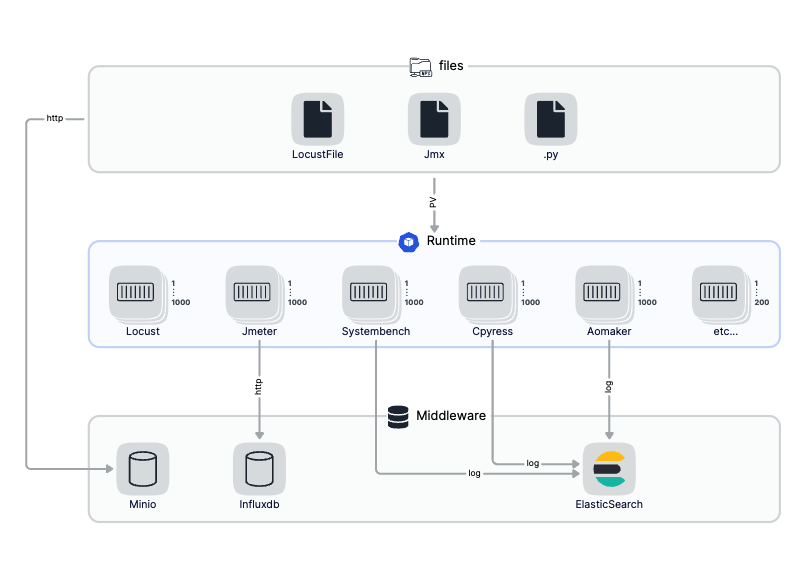
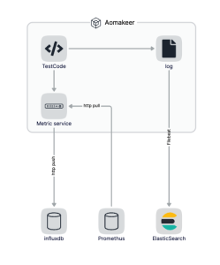

# atop

atop 将自动化测试的最佳实践设计成开放、独立和模块化的方式，让你能够运行使用任意的开发语言和框架展开高可用、可移植的测试活动

## 目标

- 测试工程师能使用任何语言, 任何框架，开展自动化测试活动
- 解决测试活动中的高可用, 弹性伸缩问题
- 构建完整的测试生态
- 致力于测试效率提升

## 它是怎么工作的

atop 提供基于容器的测试运行环境, 依托 Kubernetes 原生的高可用、弹性伸缩能力，将测试应用以应用或者服务的形式运行，通过 logfile 或者 httpservice 收集测试数据并展示。

## 为什么选择 atop?

编写高可用、分布式的测试是很困难的。atop将原生提供这种能力

atop 将自动化测试实践中搭建测试环境，执行测试、收集测试数据、发送告警等活动以模块化的形式自动化独立运行，尽可能的提高测试活动的效率。

第三方的测试应用（框架）只需要做一定程度的改造即可接入atop，构建更加完善的测试生态

## 功能

- 测试文件存储、分发、版本管理
- 测试数据收集
- 测试数据展示
- 分布式运行测试

## 测试平台

### 测试脚本分发

脚本分发又三种形式

- configMap
- initContainers
- PersistentVolume

#### configMap

文件挂载到 configMap ，使用于少量测试文件。需要维护configMap在测试活动中的生命周期，成本相对较低

#### initContainers

初始化容器在测试活动开始之前，将测试脚本从minio中下载，通过临时卷在容器之间共享，适用于大量的测试脚本、文件。测试活动完成后，自动销毁。几乎无维护成本

##### PersistentVolume

通过pv在不同节点、不同pod之间共享测试文件，需要一个文件服务来做文件生命周期的维护。

### 测试脚本执行

测试执行之前，将对应文件挂载到 pod 对应目录。同时将（测试数据、logfile）输出至指定目录。
原则上只有文件的输入和结果的输出。最大限度上保证 Runtime 的纯净和低耦合。通过更改 docker 镜像、命令和环境变量实现测试场景、类型的参数化。

### 测试数据收集

filebeat 会作为 sidacar 随 Runtime 一起启动，实时读取测试logfile 并发送到kafka

### 测试活动告警

Analysis 服务，订阅kafka数据，一方面作为实时数据传输给前端，另一方面将经过处理后的数据存储到 prometheus，并触发告警

## 测试应用

测试应用、框架仅仅只需要生成规范的、结构化的测试数据、文件。即可接入平台

## 快速开始

参考 [开始](https://github.com/ante-involutum/cli/blob/main/README.md) 指引

### 联系我们

| 平台  | 链接        |
|:----------|:------------|
| 📧 Mail | lunz1207@gmail.com

## 仓库

| 仓库 | 描述 |
|:-----|:------------|
| [Atop](https://github.com/ante-involutum/atop) | 主仓库，主要是文档、设计相关
| [CLI](https://github.com/ante-involutum/cli) | 命令行工具, 主要用于atop的安装、升级、卸载,也提供测试活动相关的快捷操作
| [Files](https://github.com/ante-involutum/files) | 测试文件存储、分发
| [Analysis](https://github.com/ante-involutum/analysis) | 测试数据过滤、整理、展示
| [Tink](https://github.com/ante-involutum/tink) | runtime 控制模块，包括创建、销毁等
| [Console](https://github.com/ante-involutum/console) | 前端页面
| [Chartrepo](https://github.com/ante-involutum/chartrepo) | Helm chart 仓库
| [Demo](https://github.com/ante-involutum/demo) | Kubernetes 应用 demo，也作为被测系统
| [Jmeter](https://github.com/ante-involutum/jmeter) | Jmeter runtime
